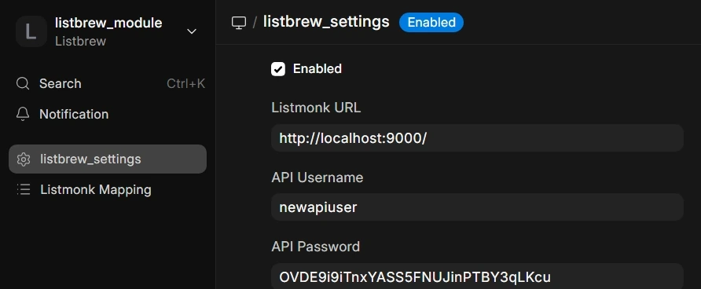
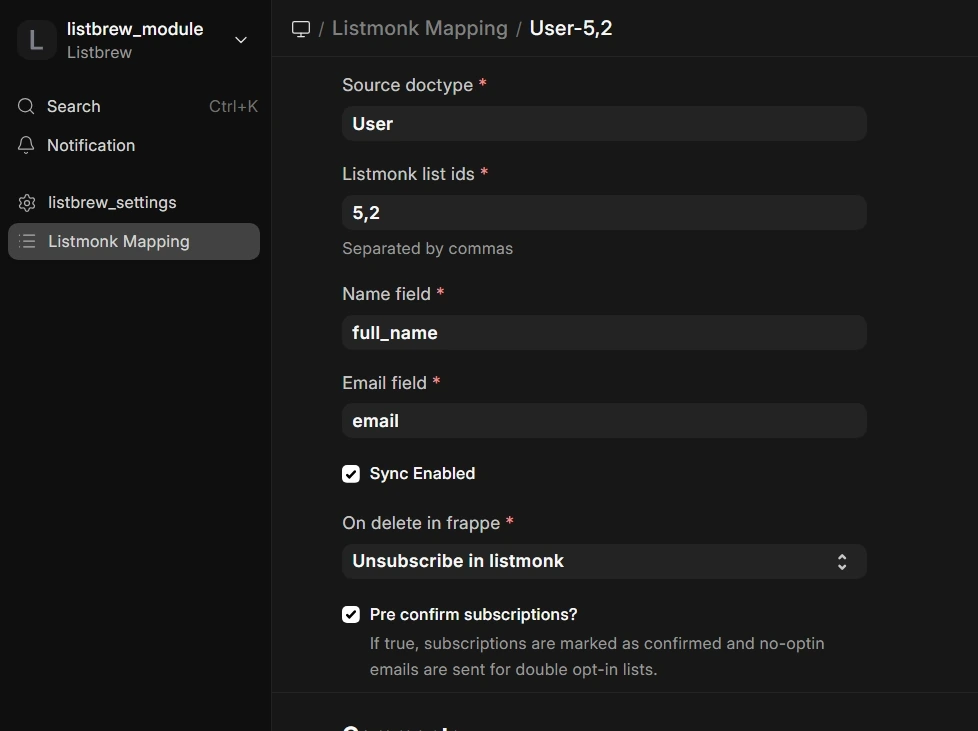

<a href="https://bodhya.net"></a>
# Listbrew

Realtime Auto sync from Frappe to Listmonk

### Screenshots

| Listbrew Settings | Listbrew Mapping |
| ----------------- | ---------------- |
|  |  |


### Setup

1. Install the app
2. Go to Listbrew module
3. Add your Listmonk settings
4. Add your mappings

### Installation

You can install this app using the [bench](https://github.com/frappe/bench) CLI:

```bash
cd $PATH_TO_YOUR_BENCH
bench get-app https://github.com/pritkr/listbrew --branch develop
bench install-app listbrew
```

### Contributing

This app uses `pre-commit` for code formatting and linting. Please [install pre-commit](https://pre-commit.com/#installation) and enable it for this repository:

```bash
cd apps/listbrew
pre-commit install
```

Pre-commit is configured to use the following tools for checking and formatting your code:

- ruff
- eslint
- prettier
- pyupgrade
### CI

This app can use GitHub Actions for CI. The following workflows are configured:

- CI: Installs this app and runs unit tests on every push to `develop` branch.
- Linters: Runs [Frappe Semgrep Rules](https://github.com/frappe/semgrep-rules) and [pip-audit](https://pypi.org/project/pip-audit/) on every pull request.


### License

mit
